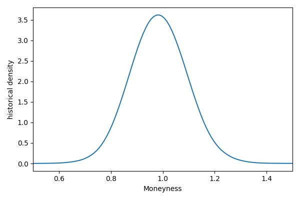
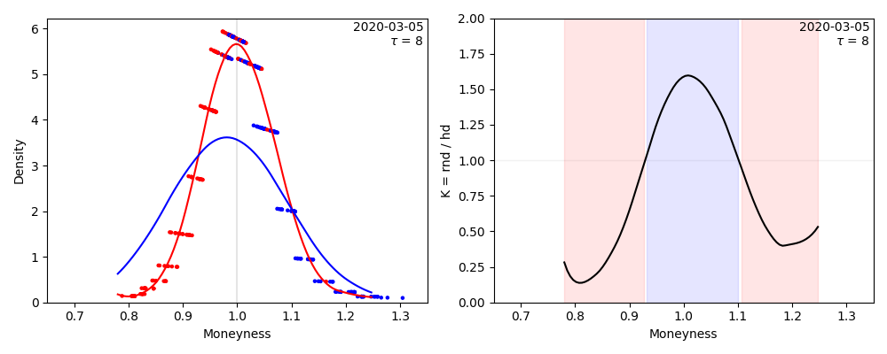

Examples
================================================================

Estimate Risk Neutral Density with ``risk_neutral_density.Calculator``
----------------------------------------------------------------------
Use the class ``risk_neutral_density.Calculator`` in order to estimate the RND via Rookley's Method::

    import os
    import pandas as pd
    from matplotlib import pyplot as plt
    from spd_trading import risk_neutral_density as rnd
    
    RND_TESTDATA_FILENAME = os.path.join(".", "examples", "data", "rnd_input_data.csv")
    rnd_input_data = pd.read_csv(RND_TESTDATA_FILENAME)
    evaluation_day = "2020-03-05"    # known from data processing
    evaluation_tau = 8               # known from data processing

    RND = rnd.Calculator(
        data=rnd_input_data,
        tau_day=evaluation_tau,
        date=evaluation_day,
        sampling="slicing",
        n_sections=15,
        loss="MSE",
        kernel="gaussian",
        h_m=0.088,                   # set None if bandwidth unknown
        h_k=215.068,                 # if unknow, use `localpoly.bandwidth_cv`
        h_m2=0.036,                  # for bandwidth optimization
    )
    RND.calc_rnd()

    RndPlot = rnd.Plot()             # Rookley Method algorithm plot
    fig_method = RndPlot.rookleyMethod(RND)

    plt.show()

.. image:: ../_static/example_rnd.png
    :height: 250
    :align: center

Estimate Historical Density with ``historical_density.Calculator``
------------------------------------------------------------------
Use the class ``historical_density.Calculator`` in order to estimate the HD via Monte Carlo Simulation on a GARCH Model of the historical data::

    import os
    import pandas as pd
    from matplotlib import pyplot as plt
    from spd_trading import historical_density as hd

    HD_TESTDATA_FILENAME = os.path.join(".", "examples", "data", "hd_input_data.csv")

    hd_input_data = pd.read_csv(HD_TESTDATA_FILENAME)
    evaluation_day = "2020-03-05"    # known from data processing
    evaluation_tau = 8               # known from data processing
    evaluation_S0 = hd_input_data.loc[
        hd_input_data.date_str == evaluation_day, "price"
    ].item()                         # either take from index or replace by other value

    HD = hd.Calculator(
        data=hd_input_data,
        S0=evaluation_S0,
        garch_data_folder=os.path.join(".", "examples", "data"),
        tau_day=evaluation_tau,
        date=evaluation_day,
        n=400,
        M=5000,
        overwrite=False,
    )
    HD.get_hd(variate=True)

    HdPlot = hd.Plot()  
    fig_denstiy = HdPlot.density(HD)

    plt.show()

Calculate and Plot Kernel with ``kernel.Plot``
----------------------------------------------------------------
Estimate RND and HD as shown in the previous examples, then use ``kernel.Plot`` to calculate the Kernel and plot the result::

    import os
    import pandas as pd
    from matplotlib import pyplot as plt
    from spd_trading import risk_neutral_density as rnd
    from spd_trading import historical_density as hd
    from spd_trading import kernel as ker

    # --------------------------------------------------------------------------- SETUP
    RND_TESTDATA_FILENAME = os.path.join(".", "examples", "data", "rnd_input_data.csv")
    HD_TESTDATA_FILENAME = os.path.join(".", "examples", "data", "hd_input_data.csv")

    rnd_input_data = pd.read_csv(RND_TESTDATA_FILENAME)
    hd_input_data = pd.read_csv(HD_TESTDATA_FILENAME)
    evaluation_day = "2020-03-05"    # known from data processing
    evaluation_tau = 8               # known from data processing
    evaluation_S0 = hd_input_data.loc[
        hd_input_data.date_str == evaluation_day, "price"
    ].item()                         # either take from index or replace by other value

    # ------------------------------------------------------------ RISK NEUTRAL DENSITY
    RND = rnd.Calculator(
        data=rnd_input_data,
        tau_day=evaluation_tau,
        date=evaluation_day,
        sampling="slicing",
        n_sections=15,
        loss="MSE",
        kernel="gaussian",
        h_m=0.088,                   # set None if bandwidth unknown
        h_k=215.068,                 # if unknow, use `localpoly.bandwidth_cv`
        h_m2=0.036,                  # for bandwidth optimization
    )
    RND.calc_rnd()

    # -------------------------------------------------------------- HISTORICAL DENSITY
    HD = hd.Calculator(
        data=hd_input_data,
        S0=evaluation_S0,
        garch_data_folder=os.path.join(".", "examples", "data"),
        tau_day=evaluation_tau,
        date=evaluation_day,
        n=400,
        M=5000,
        overwrite=False,
    )
    HD.get_hd(variate=True)

    # ----------------------------------------------------------------------- KERNEL
    Kernel = ker.Calculator(
        tau_day=evaluation_tau, 
        date=evaluation_day, 
        RND=RND, 
        HD=HD, 
        similarity_threshold=0.15, 
        cut_tail_percent=0.02
    )
    Kernel.calc_kernel()
    Kernel.calc_trading_intervals()
    
    TradingPlot = ker.Plot(x=0.35)  # kernel plot - comparison of rnd and hd
    fig_strategy = TradingPlot.kernelplot(Kernel)

