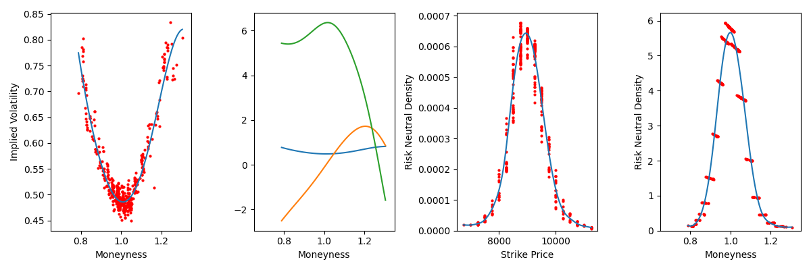

Theoretical Background
================================================================

Risk Neutral Density 
----------------------------------------------------------------
Assume that the function of interest :math:`y` is a real-valued function and is twice differentiable at :math:`z=x` for all 
:math:`x`, then there exists a linear approximation at this point. The second degree **Taylor expansion** of the function :math:`y` 
centered around :math:`z` in a neighborhood of :math:`x` is given by:

.. math::

    \begin{equation}
        y(z) \approx y(x) + \frac{\partial y(x)}{\partial X}
            + \frac{1}{2} \frac{\partial^2 y(x)}{\partial X^2} (z-x)^2
    \end{equation}
    
Rookley's Method
----------------------------------------------------------------
| step 0 : fit iv-smile to iv-over-M option values
| step 1 : calculate spd for every option-point “Rookley’s method”
| step 2 : Rookley results (points in K-domain) - fit density curve
| step 3 : transform density POINTS from K- to M-domain
| step 4 : density points in M-domain - fit density curve
| (All fits are obtained by local polynomial estimation)

The steps of the algorithm are shown in the following graphic. 

Historical Density
----------------------------------------------------------------

GARCH
----------------------------------------------------------------
Assume that the function of interest :math:`y` is a real-valued function and is twice differentiable at :math:`z=x` for all 
:math:`x`, then there exists a linear approximation at this point. The second degree **Taylor expansion** of the function :math:`y` 
centered around :math:`z` in a neighborhood of :math:`x` is given by:

.. math::

    \begin{equation}
        y(z) \approx y(x) + \frac{\partial y(x)}{\partial X}
            + \frac{1}{2} \frac{\partial^2 y(x)}{\partial X^2} (z-x)^2
    \end{equation}